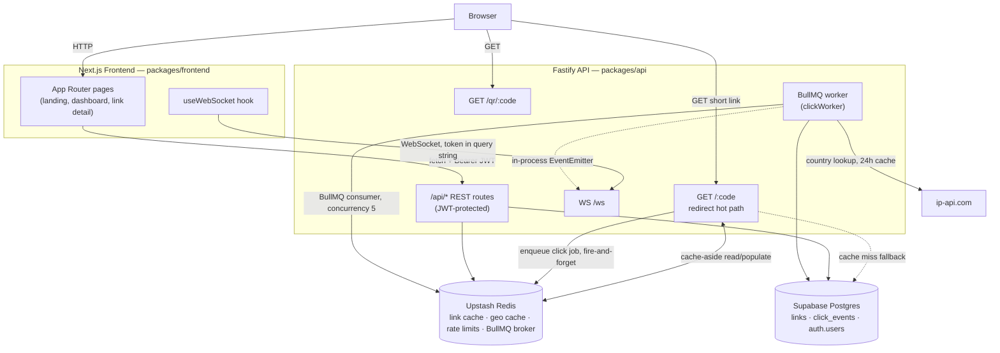
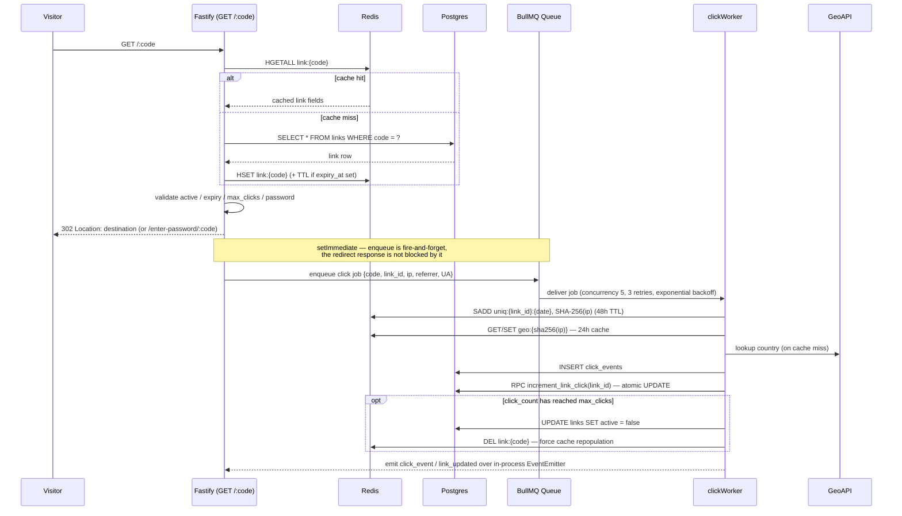
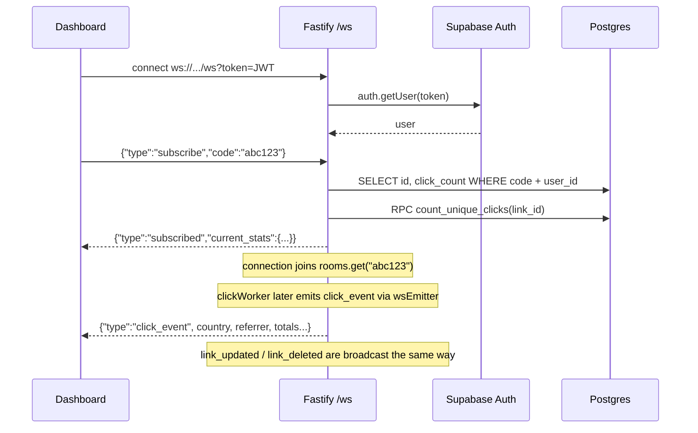
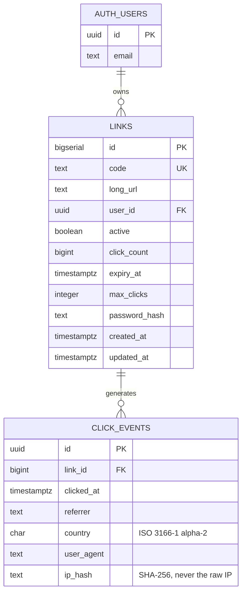

<div align="center">

# Snip.ly

**A high-performance URL shortener with a live, WebSocket-powered analytics dashboard.**

Every click streams to the dashboard the instant it happens — no polling, no refresh.

[](https://nodejs.org)
[](https://www.typescriptlang.org/)
[](https://fastify.dev)
[-000000?logo=next.js&logoColor=white)](https://nextjs.org)
[](https://supabase.com)
[](https://upstash.com)
[](https://docs.bullmq.io)

[Live Demo](https://sniply-frontend.vercel.app) · [API Reference](#api-reference) · [Architecture](#architecture)

</div>

---

## Table of Contents

- [Overview](#overview)
- [Key Features](#key-features)
- [Architecture](#architecture)
  - [System Overview](#system-overview)
  - [Redirect & Click Pipeline](#redirect--click-pipeline)
  - [Real-Time WebSocket Flow](#real-time-websocket-flow)
  - [Data Model](#data-model)
- [Tech Stack](#tech-stack)
- [Project Structure](#project-structure)
- [API Reference](#api-reference)
- [Getting Started](#getting-started)
  - [Prerequisites](#prerequisites)
  - [Installation](#installation)
  - [Environment Variables](#environment-variables)
  - [Database Setup](#database-setup)
  - [Running Locally](#running-locally)
- [Available Scripts](#available-scripts)
- [Security](#security)
- [Testing](#testing)
- [Engineering Highlights](#engineering-highlights)
- [Known Limitations & Roadmap](#known-limitations--roadmap)
- [License](#license)

---

## Overview

Snip.ly is a full-stack URL shortener built as an npm-workspaces monorepo with two independently deployable services: a **Fastify API** that owns redirects, link management, and real-time analytics, and a **Next.js 14** dashboard that consumes it. Both services are stateless — all shared state lives in **PostgreSQL (Supabase)** and **Redis (Upstash)**.

Beyond basic redirection, it supports custom slugs, click ceilings, expiring links, bcrypt-protected links, on-the-fly QR codes, and a dashboard that subscribes to a link over WebSocket and renders each click — country, referrer, timestamp — as it arrives.

The project is structured and documented the way a small production service would be: validated environment configuration, JSON-schema-typed routes, a cache-aside redirect path, an async job queue for write-heavy bookkeeping, and SQL migrations that tell the real story of how the schema evolved (see [Data Model](#data-model)).

## Key Features

**Link Management**
- Auto-generated [Base62](#engineering-highlights) short codes, or custom 3–32 character slugs (`^[a-zA-Z0-9-]+$`)
- Optional expiry timestamp, optional max-click ceiling — links auto-deactivate the moment the ceiling is reached
- Optional bcrypt-hashed password protection, gated behind a dedicated unlock flow
- Full CRUD: list (paginated, filterable by status, sortable), inspect, update, delete
- On-demand PNG/SVG QR codes for any short link

**Real-Time Analytics**
- WebSocket dashboard channel — subscribe to a link's code and receive live click events, no polling
- Per-link stats: total clicks, unique clicks, top referrers, top countries, hourly breakdown
- Country-level geolocation via IP lookup, cached for 24 hours
- Automatic link deactivation broadcast the instant a click ceiling is hit

**Security & Privacy**
- OAuth authentication (GitHub, Google) via Supabase Auth; every link-management endpoint requires a valid Bearer JWT
- Raw visitor IP addresses are **never stored** — only a SHA-256 hash salted with the link ID and date
- Passwords hashed with bcrypt (cost factor 12), never stored or logged in plaintext
- Configurable destination URL blocklist
- Helmet security headers, origin-restricted CORS, and Zod-validated environment configuration that fails fast on misconfiguration

**Performance**
- Redis-cached, cache-aside redirect hot path — a hit never touches Postgres
- Click bookkeeping (DB writes, geo lookups, unique-visitor counting) is offloaded to a background worker via BullMQ, so the redirect response is never blocked by analytics work
- Unique-click counts computed in Postgres via a `COUNT(DISTINCT ip_hash)` RPC rather than loading every click row into Node memory

## Architecture

### System Overview

Both services are stateless and horizontally scalable in principle; all durable state lives in Postgres, and all ephemeral/shared state (cache, queue, rate-limit counters) lives in Redis.



### Redirect & Click Pipeline

The redirect route (`GET /:code`) is intentionally thin: it answers from Redis whenever possible and defers every side effect that isn't required to compute the 302 response.



A **password-protected link** short-circuits before this pipeline: the redirect route sends the visitor to `/enter-password/:code` on the frontend instead of enqueueing a click job. The unlock endpoint (`POST /api/links/:code/unlock`) verifies the bcrypt hash and returns the destination URL directly to the client, which navigates there itself — see [Known Limitations](#known-limitations--roadmap).

### Real-Time WebSocket Flow

The dashboard subscribes to a specific link code over `/ws`. Delivery is handled with an in-memory "room" (`Map<code, Set<WebSocket>>`) fed by a Node `EventEmitter` that the click worker publishes to.



### Data Model



`AUTH_USERS` is owned and managed entirely by Supabase Auth (`auth.users`) — the application never writes to it directly. The four migrations under [`packages/api/migrations`](packages/api/migrations) tell the schema's real history:

| Migration | Purpose |
|---|---|
| `001_initial.sql` | Base schema: a custom `users` table (API-key auth), `links`, `click_events`, and their indexes |
| `002_increment_link_click.sql` | `increment_link_click(id)` RPC — an atomic `UPDATE ... SET click_count = click_count + 1`, avoiding a read-modify-write race across concurrent worker jobs |
| `003_supabase_oauth.sql` | Migrates `links.user_id` from the custom `users` table to `auth.users`, and drops the now-obsolete `users` table entirely |
| `004_count_unique_clicks.sql` | `count_unique_clicks(id)` RPC — pushes `COUNT(DISTINCT ip_hash)` into Postgres instead of loading every `click_events` row into Node to count it |

## Tech Stack

| Layer | Technology | Notes |
|---|---|---|
| API framework | **Fastify 5** | JSON-schema-validated routes, plugin architecture, `fast-json-stringify` on typed responses |
| API language | **TypeScript 5** (strict) | `noUnusedLocals`, `noUnusedParameters`, `strictNullChecks` all enabled |
| Frontend framework | **Next.js 14** (App Router) | Client-rendered dashboard, custom `next/font` display + body fonts |
| Frontend styling | **Tailwind CSS** | Custom dark theme (`surface` / `accent` palette), no component library |
| Database | **PostgreSQL** via **Supabase** | Row access enforced at the application layer (JWT → `user_id` scoping) |
| Cache & queue broker | **Redis** via **Upstash** (`ioredis`) | Link cache, geo cache, rate-limit counters, BullMQ backing store |
| Job queue | **BullMQ** | 3 retries with exponential backoff, capped completed/failed job retention |
| Real-time transport | **`@fastify/websocket`** | In-process pub/sub via Node `EventEmitter`, no external broker |
| Auth | **Supabase Auth** (GitHub + Google OAuth) | Bearer JWT verified server-side via `supabaseAdmin.auth.getUser()` |
| Password hashing | **bcrypt** (cost 12) | For link passwords, not user accounts (those are OAuth-only) |
| IP anonymization | **SHA-256** (`node:crypto`) | Raw IPs are hashed before they ever reach application code paths that persist data |
| QR generation | **`qrcode`** | PNG and SVG, generated on request, no external service |
| Env validation | **Zod** | `packages/api/src/config.ts` fails fast with a readable error if config is invalid |
| Testing | **Vitest** | Unit tests for the API package |
| Logging | **Pino** (+ `pino-pretty` in dev) | Structured JSON logs in production |

## Project Structure

```text
Sniply/
├── knowledge/                     # Product & engineering docs (PRD, system design, API contracts)
├── packages/
│   ├── api/                       # Fastify API — @sniply/api
│   │   ├── migrations/            # Hand-written SQL, run manually in the Supabase SQL editor
│   │   └── src/
│   │       ├── app.ts             # Fastify instance, plugin & route registration, error handler
│   │       ├── server.ts          # Entry point — starts the HTTP server + BullMQ worker, handles SIGINT/SIGTERM
│   │       ├── config.ts          # Zod-validated environment schema
│   │       ├── plugins/           # redis · postgres (Supabase clients) · bullmq · websocket
│   │       ├── routes/            # redirect · shorten · links · stats · qr · unlock · ws
│   │       ├── services/          # linkService · clickService · geoService · statsService
│   │       ├── middleware/        # auth (Bearer JWT) · rateLimitShorten (Redis counter)
│   │       ├── workers/           # clickWorker — BullMQ consumer
│   │       ├── utils/             # base62 · hash · errors · wsEmitter
│   │       └── types/             # Fastify decorations, shared interfaces
│   └── frontend/                  # Next.js dashboard — @sniply/frontend
│       ├── app/
│       │   ├── page.tsx           # Landing page + shorten form
│       │   ├── dashboard/         # Link list, filters, pagination, live feed panel
│       │   ├── links/[code]/      # Link detail — stats, chart, geo breakdown, edit/delete, QR
│       │   ├── enter-password/    # Password gate for protected links
│       │   └── privacy/           # Public privacy policy page
│       ├── components/            # ShortenForm · LinkCard · LiveClickFeed · StatsChart · GeoMap · QRModal · Login
│       ├── hooks/useWebSocket.ts  # Auto-reconnecting WS client (exponential backoff, 5 retries)
│       └── lib/                   # api.ts (typed REST client) · supabase.ts (browser client) · utils.ts
├── package.json                   # npm workspaces root
└── tsconfig.base.json             # Shared strict TypeScript config
```

## API Reference

All JSON responses follow a consistent error shape: `{ "error": "ERROR_CODE", "message": "human-readable message" }`. Request/response bodies are Fastify JSON-schema validated, which also drives fast serialization on the way out.

| Method | Path | Auth | Description |
|---|---|---|---|
| `GET` | `/` | — | Liveness/name payload |
| `GET` | `/health` | — | Health check (`{ ok: true }`) for load balancers |
| `GET` | `/:code` | — | Redirects to the destination URL (`302`); Redis-first lookup; enqueues an async click job |
| `GET` | `/qr/:code` | — | Returns a QR code image (`?size=100–1000`, `?format=png\|svg`) |
| `POST` | `/api/links/:code/unlock` | — † | Verifies a link's password, returns `{ long_url }` |
| `POST` | `/api/shorten` | Bearer JWT | Creates a short link. Rate-limited to 10 requests/user/60s |
| `GET` | `/api/links` | Bearer JWT | Paginated list — `page`, `limit` (≤100), `status`, `sort`, `order` |
| `GET` | `/api/links/:code` | Bearer JWT | Full detail incl. unique clicks and QR URL |
| `PATCH` | `/api/links/:code` | Bearer JWT | Update `url`, `active`, `expiry_at`, or `max_clicks` |
| `DELETE` | `/api/links/:code` | Bearer JWT | Deletes a link (`204 No Content`) |
| `GET` | `/api/links/:code/stats` | Bearer JWT | Totals, top referrers, top countries, hourly breakdown |
| `WS` | `/ws?token=<jwt>` | Query token | Subscribe/unsubscribe to a code, receive live click/link events |

† Intentionally public — visitors unlocking a password-protected link aren't authenticated Snip.ly users. It is the only `/api/*` route registered *outside* the JWT-protected route scope (see `app.ts`).

**Error codes** returned across the API: `LINK_NOT_FOUND`, `LINK_EXPIRED`, `LINK_INACTIVE`, `CLICK_LIMIT_REACHED`, `INVALID_SLUG`, `SLUG_TAKEN`, `URL_BLOCKED`, `INVALID_PASSWORD`, `NOT_PROTECTED`, `RATE_LIMITED`, `UNAUTHORIZED`, `INTERNAL_ERROR`.

## Getting Started

### Prerequisites

- Node.js 20+
- A [Supabase](https://supabase.com) project (Postgres database + Auth, with GitHub/Google OAuth providers configured)
- An [Upstash](https://upstash.com) Redis database

### Installation

```bash
git clone https://github.com/Basit-Ali0/Sniply.git
cd Sniply
npm install
```

This is an npm-workspaces monorepo — one install at the root wires up both `packages/api` and `packages/frontend`.

### Environment Variables

Copy `.env.example` to `.env` at the repo root (read by `packages/api/src/config.ts`), and create `packages/frontend/.env.local` for the frontend's public variables.

**API** (validated by Zod at startup — the process exits with a readable error if any required value is missing or malformed):

| Variable | Required | Description |
|---|---|---|
| `DATABASE_URL` | ✅ | Supabase Postgres connection string |
| `SUPABASE_URL` | ✅ | Supabase project URL |
| `SUPABASE_ANON_KEY` | ✅ | Supabase anon/public key |
| `SUPABASE_SERVICE_ROLE_KEY` | ✅ | Used server-side to verify JWTs and for admin queries |
| `REDIS_URL` | ✅ | Upstash Redis connection string (`rediss://...`) |
| `FRONTEND_URL` | ✅ | Used for CORS and building `short_url` values |
| `GEOIP_API_URL` | ✅ | Base URL for the IP-to-country lookup (defaults to `ip-api.com` in `.env.example`) |
| `REDIS_TOKEN` | – | Optional, depending on your Redis client setup |
| `PORT` | – | Defaults to `3001` |
| `NODE_ENV` | – | `development` \| `production` \| `test` (defaults to `development`) |
| `PUBLIC_API_URL` | – | Public base URL used to build `qr_url`; defaults to `http://127.0.0.1:$PORT` |
| `URL_BLOCKLIST` | – | Comma-separated substrings; matching destination URLs are rejected with `URL_BLOCKED` |

**Frontend** (`packages/frontend/.env.local`):

| Variable | Description |
|---|---|
| `NEXT_PUBLIC_API_URL` | Base URL of the API (defaults to `http://localhost:3001`) |
| `NEXT_PUBLIC_WS_URL` | WebSocket URL (defaults to `ws://localhost:3001/ws`) |
| `NEXT_PUBLIC_SUPABASE_URL` | Supabase project URL |
| `NEXT_PUBLIC_SUPABASE_ANON_KEY` | Supabase anon/public key |

> **Note:** `.env.example` also lists `API_KEY_SALT`, a holdover from the pre-OAuth, API-key-based auth scheme replaced by migration `003_supabase_oauth.sql`. It is no longer read anywhere in `packages/api/src` — safe to omit.

### Database Setup

Run the migrations in order against your Supabase project's SQL editor:

```text
packages/api/migrations/001_initial.sql
packages/api/migrations/002_increment_link_click.sql
packages/api/migrations/003_supabase_oauth.sql
packages/api/migrations/004_count_unique_clicks.sql
```

Then enable the GitHub and Google providers under **Supabase → Authentication → Providers**.

### Running Locally

```bash
npm run dev:api        # Fastify API on :3001 (and the BullMQ worker, in-process)
npm run dev:frontend   # Next.js dashboard on :3000
```

The frontend's `next.config.js` rewrites any path that looks like a short code (`/[a-zA-Z0-9-]+`) to the API's redirect route, so short links resolve correctly even when opened against the frontend's own origin.

## Available Scripts

Run from the repo root:

| Script | Description |
|---|---|
| `npm run dev:api` | Starts the API in watch mode (`tsx watch`) |
| `npm run dev:frontend` | Starts the Next.js dev server |
| `npm run build` | Builds `@sniply/api` (`tsc`) then `@sniply/frontend` (`next build`) |
| `npm run test` | Runs the Vitest suite for `@sniply/api` |

## Security

- **Authentication** — Supabase-issued JWTs, validated server-side per request via `supabaseAdmin.auth.getUser()`; never trusted client-side alone.
- **Password hashing** — bcrypt at cost factor 12 for link passwords; constant-time comparison via `bcrypt.compare`.
- **IP privacy** — the raw client IP is used only in-memory to derive a SHA-256 hash (salted with link ID + date for unique-visitor dedup, unsalted for the geo cache key) before anything is written to Redis or Postgres. The [privacy policy page](packages/frontend/app/privacy/page.tsx) documents this in user-facing language.
- **Transport hardening** — `@fastify/helmet` for security headers, `@fastify/cors` restricted to `FRONTEND_URL` (plus `localhost:3000` in development), `trustProxy: true` for correct client IPs behind a load balancer.
- **Input validation** — every route body/params/querystring is defined as a Fastify JSON schema, rejecting malformed requests before handler code runs.
- **Rate limiting** — link creation is capped at 10 requests per user per 60-second sliding window via a Redis `INCR` + `EXPIRE` bucket.
- **Fail-fast configuration** — `loadEnv()` refuses to start the process if required environment variables are missing or malformed, rather than running with undefined behavior.

## Testing

The API package uses **Vitest**. Coverage today is concentrated on the pure, deterministic logic that's cheapest to get right and most dangerous to get wrong:

- `utils/base62.test.ts` — round-trips 5,000 sequential IDs through `encodeBase62`/`decodeBase62`, plus known-value and invalid-input cases
- `utils/hash.test.ts` — determinism and input-sensitivity of `hashIp`, and bcrypt hash/verify round-trips

`routes/__tests__/links.test.ts` currently scaffolds the intended route-level test cases (pagination, filtering, cache invalidation, 404 handling) as `describe`/`it` blocks with placeholder assertions — they document the expected contract but don't yet exercise the real handlers against a database. Wiring these up against a test Supabase instance (or a mocked Supabase client) is the most valuable near-term addition to the test suite.

```bash
npm run test           # from the repo root
npm run test:watch     # from packages/api, for local iteration
```

## Engineering Highlights

A few decisions worth calling out for anyone reviewing the code:

- **Two-phase short-code creation.** `createLink` inserts a row with a temporary placeholder code to obtain the database-generated `BIGSERIAL` id, then updates the row with the final Base62 encoding of that id (or the caller's custom slug). This is necessary because Base62 encodes the primary key itself — there's no way to know the code before the row exists.
- **Cache-aside redirects, not write-through.** The hot path (`GET /:code`) only ever *reads* Redis and falls back to Postgres on a miss; it never blocks on a database write. All bookkeeping — click counting, geo lookups, unique-visitor tracking — happens after the 302 has already been sent, via a BullMQ job enqueued with `setImmediate`.
- **Atomic counters live in the database, not the app.** Both `increment_link_click` and `count_unique_clicks` are Postgres RPCs (`SECURITY DEFINER` SQL functions), not read-modify-write round trips or in-memory aggregation in Node — avoiding race conditions under concurrent worker jobs and avoiding loading every `click_events` row into memory to count them.
- **IP hashing is purpose-specific, not one-size-fits-all.** `hashIp(ip, linkId, date)` salts with the link and day for unique-visitor deduplication (so the same visitor hashes differently across links and days), while `hashGeoCacheKey(ip)` is unsalted, since it only needs to be a stable cache key.
- **Real-time delivery is fully decoupled from HTTP.** The click worker doesn't call into route handlers to notify subscribers — it emits `click_event` / `link_updated` / `link_deleted` on a shared Node `EventEmitter` (`wsEmitter`), which the WebSocket route subscribes to independently. The queue consumer has no knowledge that WebSockets even exist.

## Known Limitations & Roadmap

Documented honestly, as of the current codebase:

- **Password-protected links don't record click analytics.** The unlock flow (`POST /api/links/:code/unlock`) returns the destination URL as JSON for the client to navigate to, rather than routing back through `GET /:code` — so it never enqueues a click job. Visits to protected links aren't counted or included in stats.
- **WebSocket broadcast is single-process.** Subscription rooms live in an in-memory `Map` and events are relayed through a local `EventEmitter`. This works cleanly for a single API instance; running multiple API instances behind a load balancer would need a shared pub/sub layer (e.g., Redis pub/sub) so a click processed by the worker reaches a dashboard connected to a different instance.
- **Route-level test coverage is scaffolded, not implemented** (see [Testing](#testing)).
- **Minor doc/code drift.** `knowledge/SYSTEM_DESIGN.md` references a `services/qrService.ts` and `middleware/rateLimit.ts` that don't exist as separate files — that logic lives inline in `routes/qr.ts` and as `middleware/rateLimitShorten.ts` respectively. The design doc's illustrative Base62 examples also don't all match the single scheme the implementation actually uses — the code comment in `utils/base62.ts` and its round-trip test are the source of truth.
- **A couple of unused legacy types remain** in `types/index.ts` (`User`, `Link`, `ClickEvent`) — leftovers from before the schema was driven directly off Supabase query results; only `GeoResponse` from that file is actually imported elsewhere.

Reasonable next steps: a shared pub/sub backbone for multi-instance WebSocket delivery, integration tests against a real or mocked Supabase client, and a CI workflow to run `npm run build` and `npm run test` on push (no GitHub Actions workflow exists in the repository today).

## License

No `LICENSE` file is currently included in this repository. Until one is added, all rights are reserved by the author.

---

<div align="center">

Built by [Basit Ali](https://github.com/Basit-Ali0)

</div>
